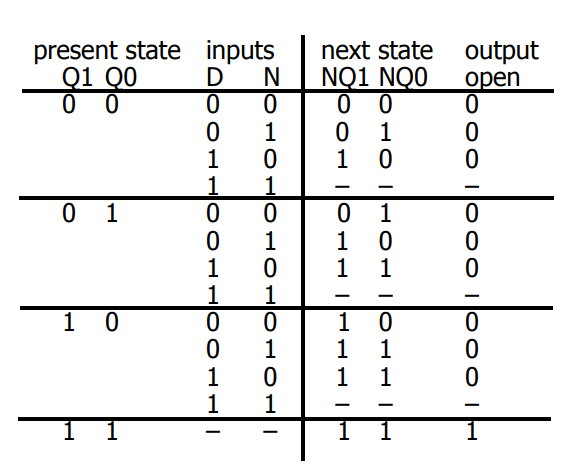
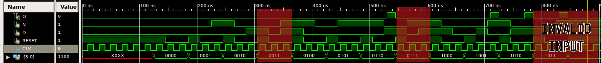
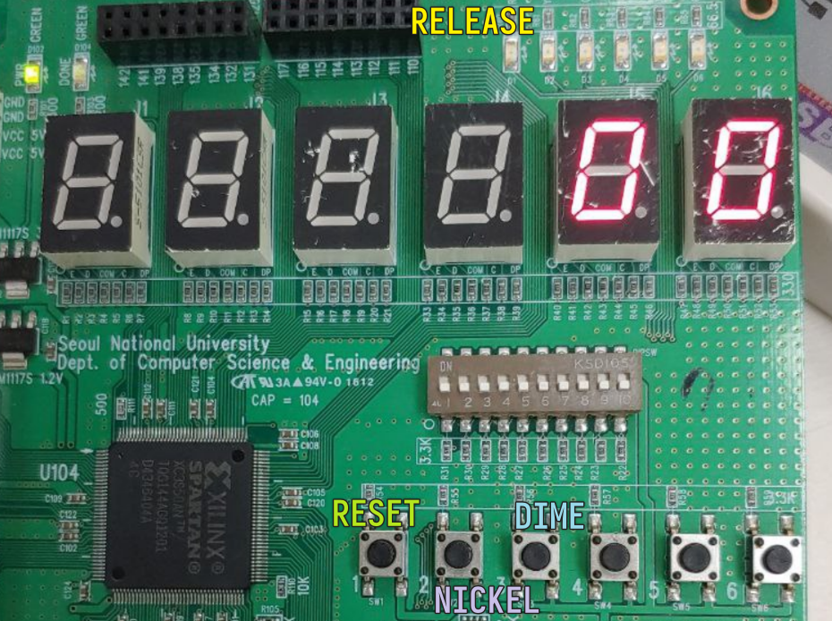
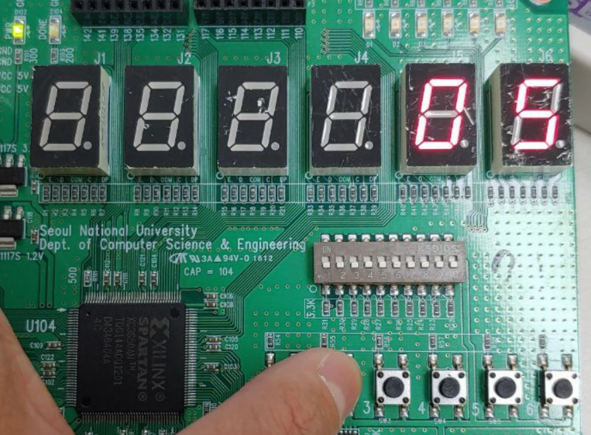
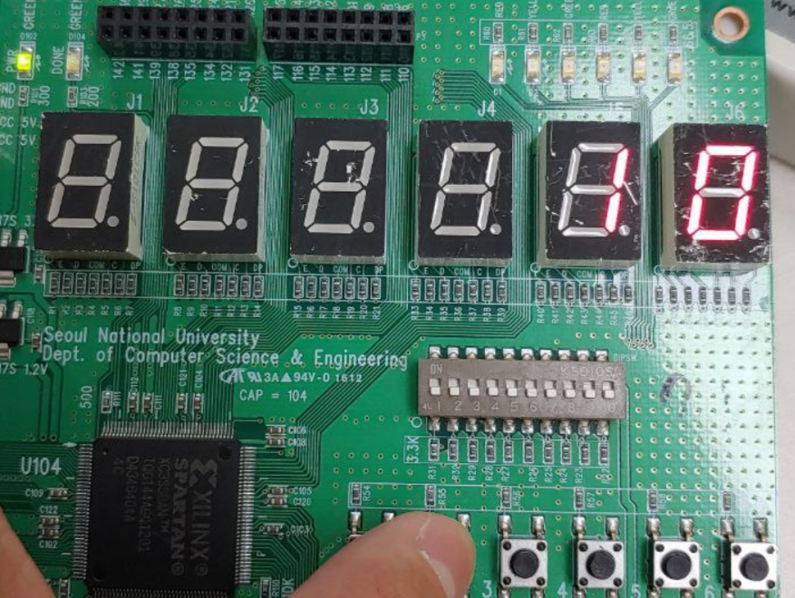
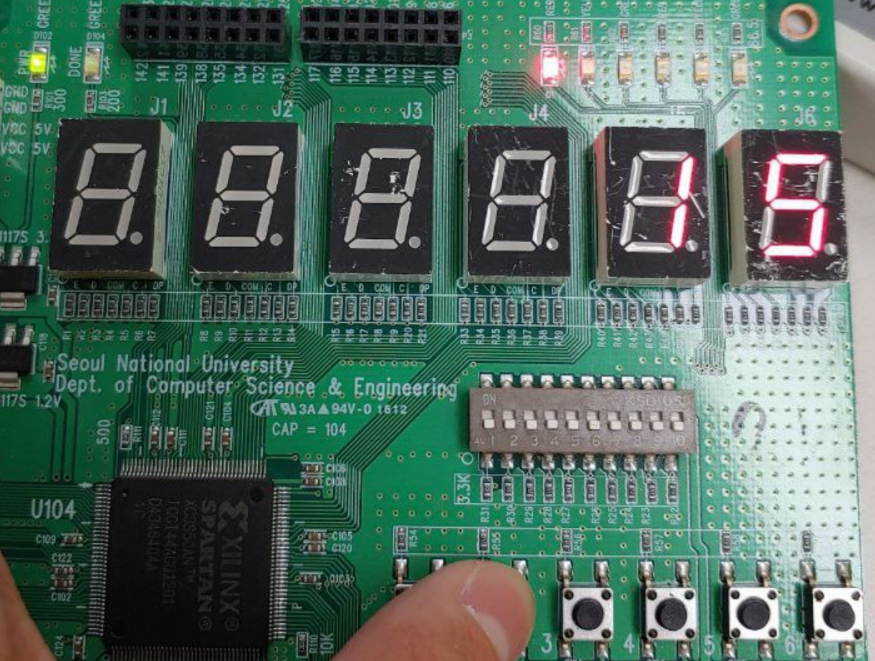
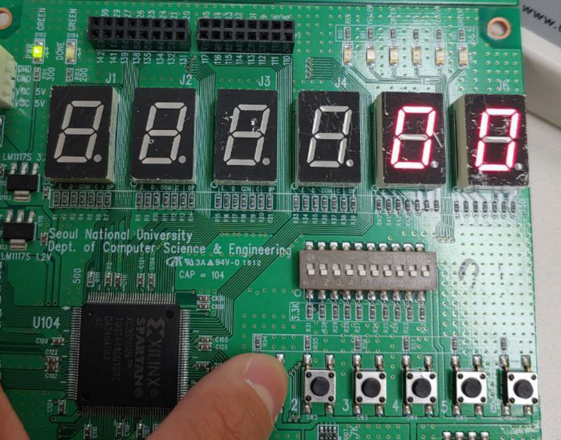

# Lab Report 08

## Lab 1

### Core logic of vending machine

It accepts nickels (`N`), and dimes (`D`), an asynchronous `RESET` and the clock `CLK` as inputs. It will set `O` to high and release item if the deposit reaches `15`.

```verilog
module vm_moore(
    input N,
    input D,
    input RESET,
    input CLK,
    output O
    );

  // One-hot encoding of internal states
  parameter [3:0] NO_MONEY  = 4'b0001, // 0$
                  A_NICKEL  = 4'b0010, // 5$
                  A_DIME    = 4'b0100, // 10$
                  FIFTEEN   = 4'b1000; // 15$
  reg [3:0] state;

  always @(posedge CLK or posedge RESET) begin
    if (RESET) begin
      state = NO_MONEY;
    end else begin
      case (state)
        NO_MONEY: begin
          if (RESET) begin
            state = NO_MONEY;
          end else if (N) begin
            state = A_NICKEL;
          end else if (D) begin
            state = A_DIME;
          end else begin
            state = NO_MONEY;
          end
        end
        A_NICKEL: begin
          if (RESET) begin
            state = NO_MONEY;
          end else if (N) begin
            state = A_DIME;
          end else if (D) begin
            state = FIFTEEN;
          end else begin
            state = A_NICKEL;
          end
        end
        A_DIME: begin
          if (RESET) begin
            state = NO_MONEY;
          end else if (N || D) begin
            state = FIFTEEN;
          end else begin
            state = A_DIME;
          end
        end
        FIFTEEN: begin
          if (RESET) begin
            state = NO_MONEY;
          end else begin
            state = FIFTEEN;
          end
        end
      endcase
    end
  end

  assign O = (state == FIFTEEN)? 1 : 0;
endmodule
```

### Simulation

The simulation is basically just simulating the state table.





## Lab 2

### Improved core logic

The core logic implemented in the previous section is modified to make BCD visualization easier.

```diff
 module vm_moore(
     input N,
     input D,
     input RESET,
     input CLK,
+    output [3:0] BCD1, // for the ease of BCD conversion
+    output [3:0] BCD0,
     output O
     );

   // One-hot encoding of internal states
   parameter [3:0] NO_MONEY  = 4'b0001, // 0$
                   A_NICKEL  = 4'b0010, // 5$
                   A_DIME    = 4'b0100, // 10$
                   FIFTEEN   = 4'b1000; // 15$
   reg [3:0] state;

   always @(posedge CLK or posedge RESET) begin
     if (RESET) begin
       state = NO_MONEY;
     end else begin
       case (state)
         NO_MONEY: begin
           if (RESET) begin
             state = NO_MONEY;
           end else if (N) begin
             state = A_NICKEL;
           end else if (D) begin
             state = A_DIME;
           end else begin
             state = NO_MONEY;
           end
         end
         A_NICKEL: begin
           if (RESET) begin
             state = NO_MONEY;
           end else if (N) begin
             state = A_DIME;
           end else if (D) begin
             state = FIFTEEN;
           end else begin
             state = A_NICKEL;
           end
         end
         A_DIME: begin
           if (RESET) begin
             state = NO_MONEY;
           end else if (N || D) begin
             state = FIFTEEN;
           end else begin
             state = A_DIME;
           end
         end
         FIFTEEN: begin
           if (RESET) begin
             state = NO_MONEY;
           end else begin
             state = FIFTEEN;
           end
         end
       endcase
     end
   end

   assign O = (state == FIFTEEN)? 1 : 0;
+  assign BCD0 = (state == NO_MONEY) ? 4'b0000 :
+                (state == A_NICKEL) ? 4'b0101 :
+                (state == A_DIME)   ? 4'b0000 :
+                4'b0101;
+  assign BCD1 = (state == NO_MONEY) ? 4'b0000 :
+                (state == A_NICKEL) ? 4'b0000 :
+                (state == A_DIME)   ? 4'b0001 :
+                4'b0001;

 endmodule
```

### Frequency divider

```verilog
module freq_divider(
    input clr,
    input clk,
    output reg clkout
    );

  reg[31:0] cnt;

  always @(posedge clk) begin
    if (clr) begin
        cnt <= 32'd0;
        clkout <= 1'b0;
    end
    else if (cnt == 32'd25000000) begin
        cnt <= 32'd0;
        clkout <= ~clkout;
    end
    else begin
        cnt <= cnt + 1;
    end
  end

endmodule
```

### BCD to 7 segment

```verilog
module bcd_to_7(
    input [3:0] bcd,
    output reg [6:0] seg
    );

  always @(bcd) begin
    case(bcd)
      4'd0: seg <= 7'b0111111;
      4'd1: seg <= 7'b0000110;
      4'd2: seg <= 7'b1011011;
      4'd3: seg <= 7'b1001111;
      4'd4: seg <= 7'b1100110;
      4'd5: seg <= 7'b1101101;
      4'd6: seg <= 7'b1111101;
      4'd7: seg <= 7'b0000111;
      4'd8: seg <= 7'b1111111;
      4'd9: seg <= 7'b1101111;
    endcase
  end

endmodule
```

### Vending machine main logic

```verilog
module vm_main(
    input N,
    input D,
    input RESET,
    input CLK,
    output [6:0] D1,
    output [6:0] D0,
    output rel
    );

  wire clock_sec;

  freq_divider fd(
    .clr(0), .clk(CLK), .clkout(clock_sec)
  );

  wire [3:0] state;
  wire [3:0] dig1;
  wire [3:0] dig0;

  vm_moore core(
    .RESET(RESET), .CLK(clock_sec), .N(N), .D(D),
    .BCD1(dig1), .BCD0(dig0), .O(rel)
  );

  bcd_to_7 show1(
    .bcd(dig1), .seg(D1)
  );
  bcd_to_7 show0(
    .bcd(dig0), .seg(D0)
  );

endmodule
```

### On-board simulation result

#### Pin assignment



#### Inserting 1 nickel



#### Inserting 2 nickels / 1 dime



#### Release (3*nickels / 1dime1nickel / 2dimes ...)



#### Reset



## Discussion

### Mistakes Made

The `always` loop used to be like:

```verilog
always @(posedge CLK or posedge RESET) begin
    case (state)
        NO_MONEY: begin
            if (RESET) begin
                state = NO_MONEY;
            end else if (N) begin
                state = A_NICKEL;
            end else if (D) begin
                state = A_DIME;
            end else begin
                state = NO_MONEY;
            end
        end
        A_NICKEL: begin
            if (RESET) begin
                state = NO_MONEY;
            end else if (N) begin
                state = A_DIME;
            end else if (D) begin
                state = FIFTEEN;
            end else begin
                state = A_NICKEL;
            end
        end
        A_DIME: begin
            if (RESET) begin
                state = NO_MONEY;
            end else if (N || D) begin
                state = FIFTEEN;
            end else begin
                state = A_DIME;
            end
        end
        FIFTEEN: begin
            if (RESET) begin
                state = NO_MONEY;
            end else begin
                state = FIFTEEN;
            end
        end
    endcase
  end
```

where the `case` pattern matching statement is directly under the `always` loop. However, since we used `posedge RESET` to enable asynchronous `RESET`, such structure is not supported by the FPGA board when we tried to run `PlanAhead`. We add an `if (RESET)` statement and put `case(state)...` in the `else` branch, which solved the problem

### Comparison between Moore and Mealy machine

* Moore machine:  outputs associated with state
* Mealy machine: outputs associated with transitions; output can produce 1 clock earlier than Moore implementation
